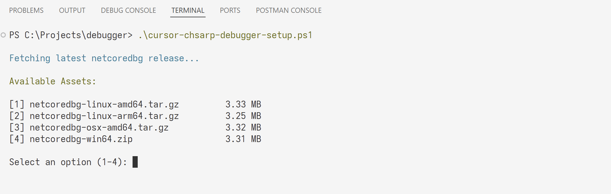

## Execute Program
> `` .\cursor-chsarp-debugger-setup.ps1``

> If you Want this configuration for all your .NET projects? Add the launch configuration to your user settings (preferences > user settings) as described in this [[VS Code issue discussion.](https://github.com/microsoft/vscode/issues/18401#issuecomment-272400316)]
